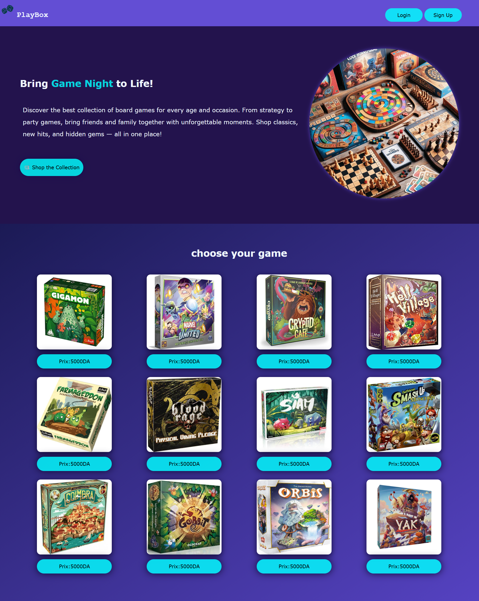
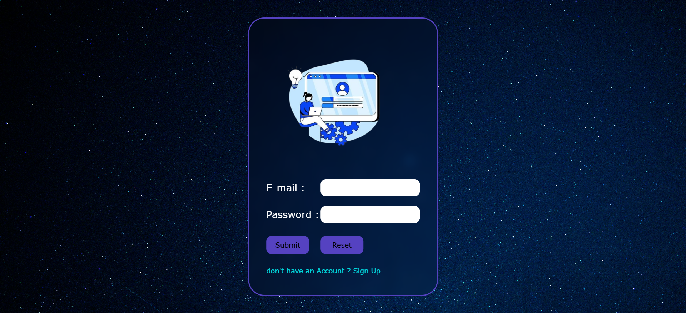
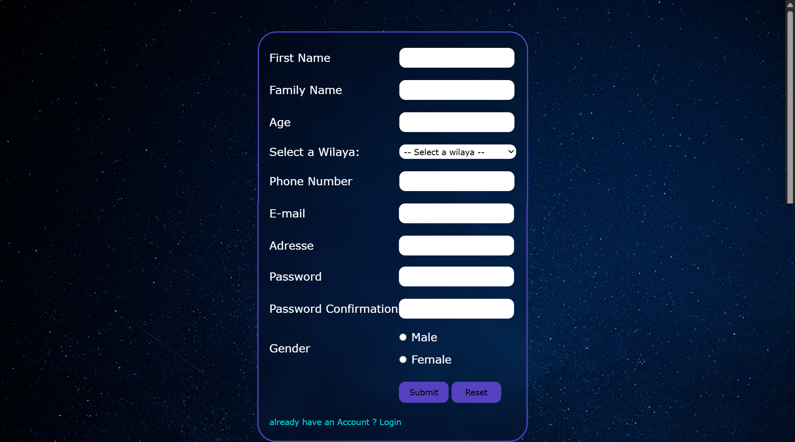

# PlayBox-E-commerce-Website-for-Board-Games

PlayBox is a **desktop-only** e-commerce website created as a university project for the **DAW (Development of Web Applications)** module. The website simulates a platform for browsing and purchasing board games online.

This project followed strict academic constraints:

- ❌ No Flexbox or CSS Grid
- ❌ No `
` elements
- ❌ No external frameworks (Bootstrap, etc.)
- ✅ All layout is built using HTML `<table>` elements

Despite these limitations, PlayBox offers core e-commerce features using only basic web technologies.

---

# Project Structure

PlayBox 
├── images/ (Contains all product and design images ) 
├── screenshots/ (Screenshots of various pages) 
├── commande_product.html (Product detail page (single product)) 
├── commande.php (Handles order logic) 
├── index.html (Home page showing product cards) 
├── inscription.html (User registration form (front-end)) 
├── inscription.php (User registration logic (back-end)) 
├── login.html (Login form (front-end)) 
├── login.php (Login logic (back-end)) 
├── styles.css (Site styling) 
├── validation.js (JavaScript for input validation) 
└── README.md (Project documentation) 

---

## 💻 Technologies Used

- **HTML** – Table-based layout structure
- **CSS** – Custom styling for desktop view
- **JavaScript** – Form validation
- **PHP** – Server-side processing (login, registration, orders)
- **MySQL** – User and order management  
  _(Database schema not included in this repo)_

---

## 📸 Screenshots

### 🏠 Home Page

### 🔐 Login Page

### 📝 Sign Up Page

### 🎯 Product Page

---

## 📌 Notes

- This project is optimized **only for desktop resolution**.
- It follows academic instructions that focus on building from scratch without modern layout tools.

---

## 📚 License

This project was created for academic purposes and is not intended for production use.
