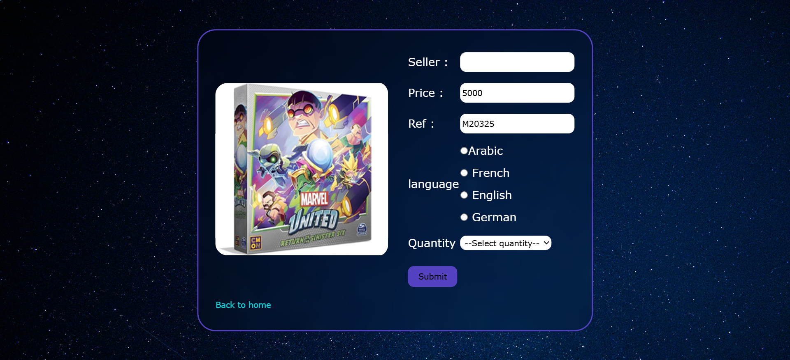

# PlayBox-E-commerce-Website-for-Board-Games

PlayBox is a **desktop-only** e-commerce website created as a university project for the **DAW (Development of Web Applications)** module. The website simulates a platform for browsing and purchasing board games online.

This project followed strict academic constraints:

- ❌ No Flexbox or CSS Grid
- ❌ No `<div>` elements
- ❌ No external frameworks (Bootstrap, etc.)
- ✅ All layout is built using HTML `<table>` elements

Despite these limitations, PlayBox offers core e-commerce features using only basic web technologies.

---

## 📁 Project Structure

/PlayBox
│
├── images/ # Contains all images used (products, design, etc.)
├── index.html # Home page showing product cards
├── login.html # Login form (front-end)
├── login.php # Login logic (back-end)
├── inscription.php # User registration form
├── validation.js # JavaScript for forms validation
├── commande_produit.html # Product detail page (single product)
├── commande.php # Handles the order logic
├── styles.css # Site styling

## 💻 Technologies Used

- **HTML (with table-based layout)**
- **CSS** – For custom desktop styling
- **JavaScript** – Input validation
- **PHP** – Server-side processing (login, orders, registration)
- **MySQL** – For managing users and orders (database not included in this repo)

---

## 📸 Screenshots

```markdown
### 🏠 Home Page


### 🔐 Login Page


### 🔐 SignUp Page


### 🎯 Product Page


```
